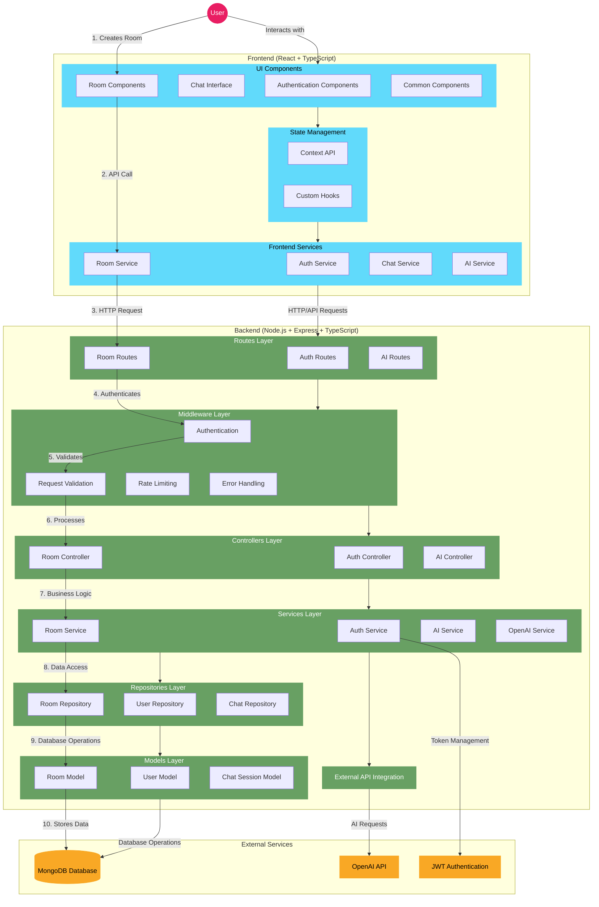

# Blind Judge


> An AI-powered platform for impartial comparison of different perspectives on complex topics.

## Overview

Blind Judge is a web application that facilitates anonymous, unbiased comparison of conclusions drawn by different participants on the same topic.
The system leverages AI to provide impartial analysis of differing viewpoints, helping users gain deeper understanding of complex issues.

## Features

- 🔒 **Private Discussion Rooms**: Create password-protected rooms with guiding questions
- 💬 **AI-Assisted Exploration**: Chat with AI to explore different perspectives on the topic
- 🧠 **Independent Conclusions**: Develop conclusions without being influenced by other participants
- ⚖️ **Impartial Analysis**: AI-powered comparison of different perspectives
- 📊 **Final Verdict**: Detailed analysis highlighting strengths of each viewpoint

## How It Works

1. **Room Creation**: A user creates a discussion room with a guiding question and password
2. **Participant Joining**: A second participant joins using the room ID and password
3. **Individual Exploration**: Each participant privately discusses the topic with an AI assistant
4. **Conclusion Submission**: Participants submit their final conclusions
5. **AI Comparison**: The system analyzes both conclusions impartially
6. **Results Presentation**: Both participants receive detailed comparison and analysis

## Tech Stack

### Backend
- **Node.js** & **Express.js**: Server framework
- **TypeScript**: Type-safe JavaScript
- **MongoDB** & **Mongoose**: Database and ODM
- **JWT**: Authentication
- **OpenAI API**: AI-powered chat and comparison
- **Jest**: Unit tests

### Frontend
- **React**: UI library
- **TypeScript**: Type-safe JavaScript
- **CSS**: Styling
- **Axios**: API communication

## Architecture

Blind Judge follows a layered architecture pattern:

- **Routes Layer**: Handles HTTP request routing and API endpoints
- **Controllers Layer**: Processes HTTP requests and manages responses
- **Services Layer**: Contains business logic and orchestrates operations
- **Repositories Layer**: Manages data access operations
- **Models Layer**: Defines data structures and database schemas

### Key Design Patterns

- **Repository Pattern**: Separates data access from business logic
- **Dependency Injection**: Enhances testability and flexibility
- **Middleware Composition**: Reusable request processing components
- **Layered Architecture**: Clear separation of concerns

## Getting Started

### Prerequisites

- Node.js (v14+)
- MongoDB (local or Atlas)
- OpenAI API key

### Installation

1. Clone the repository:

2. Install dependencies:
   ```bash
   # Install backend dependencies
   cd server
   npm install

   # Install frontend dependencies
   cd ../client
   npm install
   ```

3. Create a `.env` file in the server directory:
   ```
   PORT=3000
   MONGODB_URI=mongodb://localhost:27017/blind-judge
   JWT_SECRET=your_jwt_secret
   OPENAI_API_KEY=your_openai_api_key
   MAX_TOKENS_PER_REQUEST=2000
   NODE_ENV=development
   ```

4. Start the development servers:
   ```bash
   # Start backend server
   cd server
   npm run dev

   # Start frontend server
   cd ../client
   npm start
   ```

5. Open your browser and navigate to `http://localhost:3001`

## API Documentation

### Authentication Endpoints

- `POST /api/auth/register`: Register a new user
- `POST /api/auth/login`: Login a user

### Room Endpoints

- `POST /api/rooms`: Create a new room
- `POST /api/rooms/:roomId/join`: Join an existing room
- `GET /api/rooms/:roomId/status`: Get room status

### Chat Endpoints

- `POST /api/rooms/:roomId/chat/init`: Initialize a chat session
- `POST /api/rooms/:roomId/chat/message`: Send a message in chat
- `GET /api/rooms/:roomId/chat/history`: Get chat history

### Conclusion Endpoints

- `POST /api/rooms/:roomId/conclude`: Submit a conclusion
- `POST /api/rooms/:roomId/chat/conclude`: Submit conclusion from last AI response
- `POST /api/ai/:roomId/compare`: Compare conclusions

## Testing

Run the test suite with:

```bash
# Run backend tests
cd server
npx jest tests/roomRoutes.test.ts
npx jest tests/authRoutes.test.ts
```

## Project Structure

```
blind-judge/
├── server/               # Backend code
│   ├── src/
│   │   ├── config/       # Application configuration
│   │   ├── controllers/  # Request handlers
|   |   ├── errors        # App error handler
│   │   ├── middleware/   # Express middleware
│   │   ├── models/       # Database models
│   │   ├── repositories/ # Data access layer
│   │   ├── routes/       # API routes
│   │   ├── services/     # Business logic
│   │   ├── tests/        # unit tests
│   │   ├── types/        # TypeScript types
│   │   ├── utils/        # Utility functions
│   │   └── server.ts     # Server entry point
│   └── package.json
│
└── client/               # Frontend code
    ├── src/
    │   ├── components/   # React components
    │   ├── contexts/     # React contexts
    │   ├── hooks/        # Custom hooks
    │   ├── pages/        # Page components
    │   ├── services/     # API services
    │   ├── styles/       # global css styles
    │   ├── types/        # TypeScript types
    │   ├── utils/        # Utility functions
    │   └── App.tsx       # Main application
    ├── public/           # Static assets
    └── package.json
```
## Project Architecture



## Contributing

Contributions are welcome! Please feel free to submit a Pull Request.

1. Fork the repository
2. Create your feature branch (`git checkout -b feature/amazing-feature`)
3. Commit your changes (`git commit -m 'Add some amazing feature'`)
4. Push to the branch (`git push origin feature/amazing-feature`)
5. Open a Pull Request

## License

This project is licensed under the MIT License - see the [LICENSE](LICENSE) file for details.

## Contact

Daniel Papkov - papkovdaniel1@gmail.com

Project Links:
#[frontend] - [https://github.com/daniel-papkov/blindjudge].
#[backend]  - [https://github.com/daniel-papkov/blindjudgeserver].

## Acknowledgements

- [OpenAI](https://openai.com) for providing the AI capabilities
- [Express.js](https://expressjs.com)
- [React](https://reactjs.org)
- [MongoDB](https://www.mongodb.com)
- [TypeScript](https://www.typescriptlang.org)
